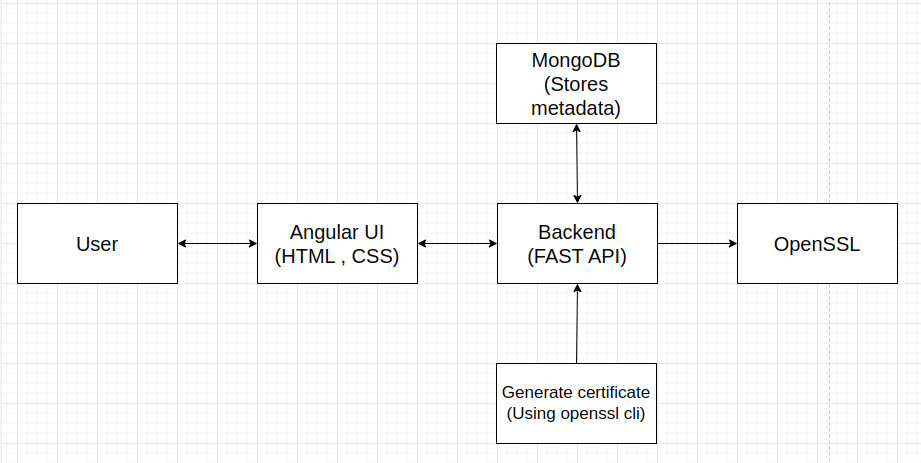

# Approach Paper

## SSL and CA Certificate Generation System

---

## Table of Contents

1. [Objective](#objective)
2. [Proposed Solutions](#proposed-solutions)
3. [Approach 1: Details](#approach-1-details)
   - [Architecture Diagram](#architecture-diagram)
   - [Description](#description)
   - [Pre-requisites](#pre-requisites)
     - [Hardware Requirements](#hardware-requirements)
     - [Software Requirements](#software-requirements)
     - [Networking Requirements](#networking-requirements)

---

## 1. Objective
The objective of this project is to develop a website that generates SSL and CA certificates based on user inputs. The system should allow users to enter relevant certificate details via a web interface, process the data using OpenSSL commands in the backend, and provide the generated certificate for download. 

## 2. Proposed Solutions
The website will be built using an Angular frontend, a FastAPI backend, and MongoDB as the database. The backend will handle OpenSSL command execution for certificate generation and store relevant metadata in MongoDB for tracking and validation. 

## 3. Approach 1: Details

### 3.1. Architecture Diagram

### 3.2. Description
The system follows a structured workflow:

1. The user enters certificate details such as Common Name, Organization, Country, etc., via the Angular frontend.
2. The FastAPI backend receives this data and executes OpenSSL commands to generate the certificate.
3. The generated certificate is stored in a designated directory and made available for download.
4. The system stores metadata (e.g., Serial Number, Expiry Date) in MongoDB for tracking and verification.

**Pros:**
- Fully automated certificate generation process.
- Secure storage of certificate details in MongoDB.
- Scalable due to containerized deployment.
- User-friendly web interface for easy interaction.

**Cons:**
- Requires proper authentication and security measures to prevent misuse.
- Dependency on OpenSSL for certificate generation.

### 3.3. Pre-requisites

#### 3.3.1. Hardware Requirements
- Server with at least 4 CPU cores and 8GB RAM.
- Minimum 50GB storage for storing generated certificates.

#### 3.3.2. Software Requirements
- **Operating System:** Ubuntu 20.04 or later
- **Backend:** FastAPI (Python 3.9+)
- **Frontend:** Angular (v16 or later)
- **Database:** MongoDB (v6.0+)
- **Containerization:** Podman
- **Certificate Management:** OpenSSL (latest version)

#### 3.3.3. Networking Requirements
- Secure network access for certificate verification.
- Firewall configurations to allow necessary API requests.
- Internet access for updates and dependencies.

---

This approach provides a secure, automated, and efficient way to generate SSL and CA certificates while maintaining flexibility.
