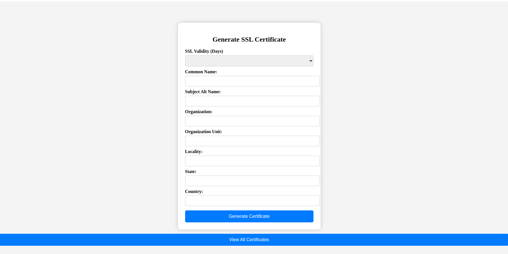
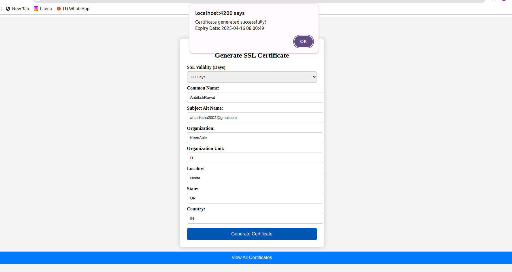
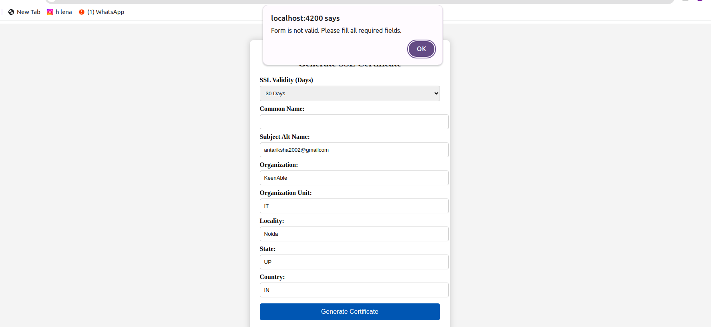
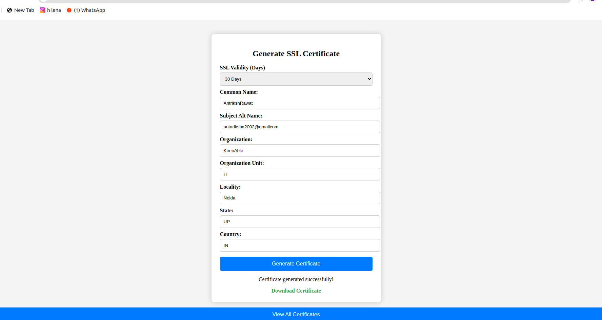
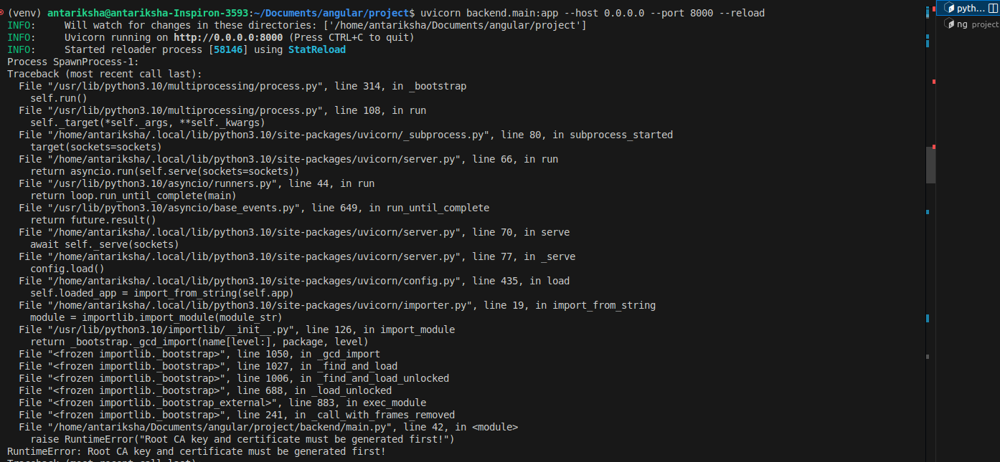
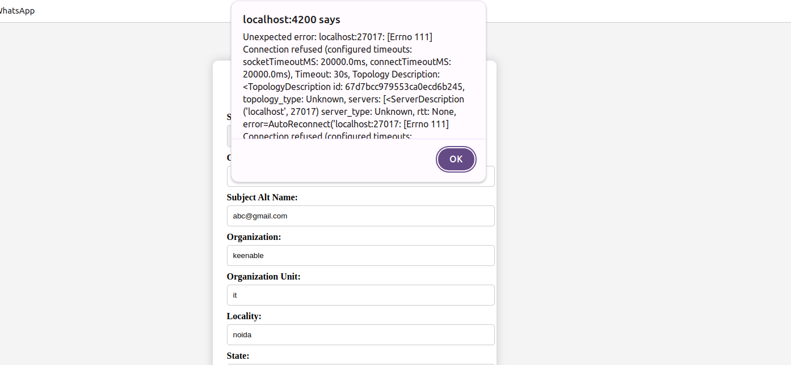
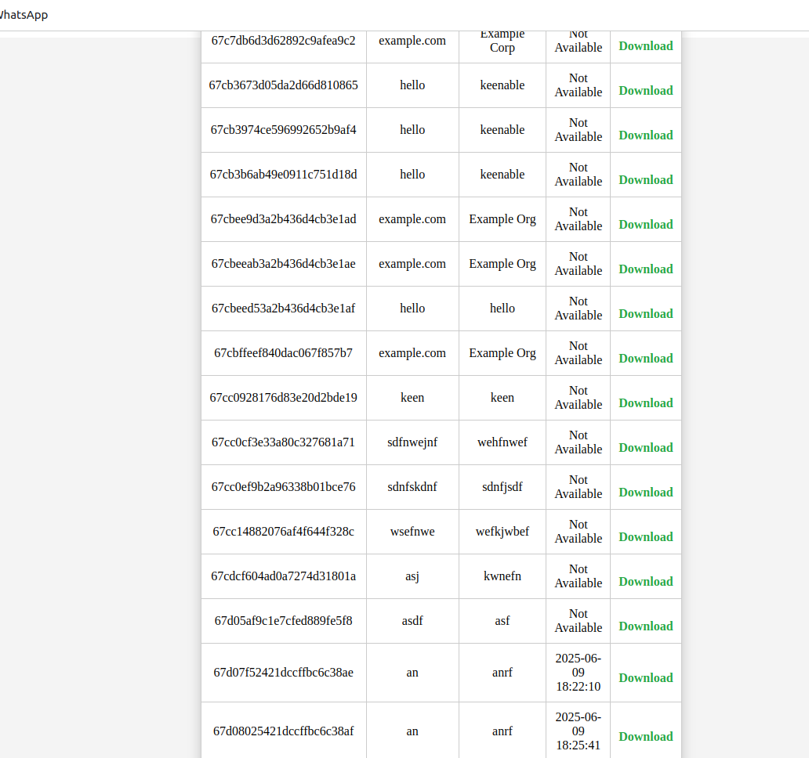
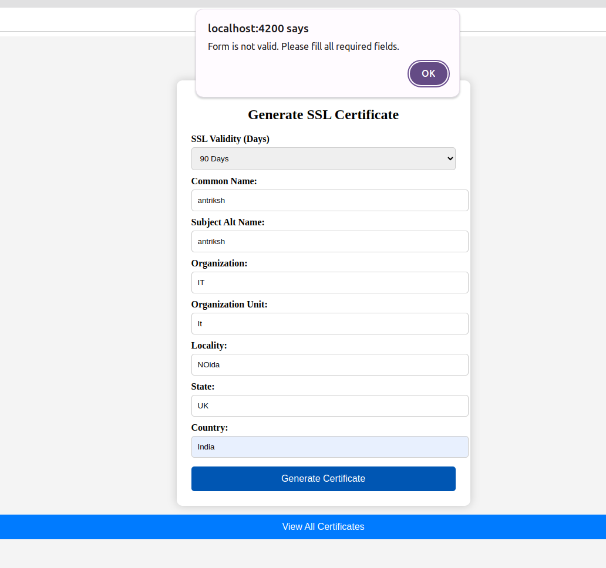

# **TEST CASES - SSL Certificate Generation Project**  

## **Submitted By**  
Antariksha Rawat  

## **Submitted To**  
Mr. Vipin Tripathi 

## **Test Case Version**  
1.0  

## **Reviewer Name**  
  

---

## **Goal**  
The objective of this project is to allow users to input SSL certificate details (Common Name, Subject Alternative Names, Organization, etc.), process them through OpenSSL via a backend API, and generate downloadable SSL certificates. The system should validate inputs, execute OpenSSL commands securely, and provide proper error handling and logging.

---

## **Table of Contents**  
- [Test Environment](#test-environment)  
- [TC1: Valid SSL Certificate Generation](#tc1-valid-ssl-certificate-generation)  
- [TC2: Handling Missing Fields](#tc2-handling-missing-fields)  
- [TC3: Generated Download Certificate](#tc3-generated-download-certificate)  
- [TC4: OpenSSL Execution Failure](#tc4-openssl-execution-failure)  
- [TC5: Database Connection Failure](#tc5-database-connection-failure)  
- [TC6: Display All Generated Certificates](#tc6-display-all-generated-certificates)  
- [TC7: Country Name Validation](#tc7-country-name-validation)  

---

## **Test Environment**  
The testing environment consists of:  
- Flask-based frontend for form submission  
- FastAPI-based backend for processing OpenSSL commands  
- OpenSSL installed on the backend server  
- Valkey and PostgreSQL for session and data storage  
- Postman or web interface for API testing  

---

## **TC1: Valid SSL Certificate Generation**  

### **Scenario**  
A user submits valid certificate details, and the system successfully generates an SSL certificate.  

### **Remarks**  
N/A  

### **Given**  
- The user provides all required fields with valid data.  
- The backend API is running and correctly configured.  

### **When**  
- The user submits the form.  

### **Then**  
- The OpenSSL command executes successfully.  
- A certificate file (`.crt` ) is generated and stored.  
- The user receives a download link.  

### **Test Run**  
**Date:** 15-03-2025

### **Result**  Pass
 

### **Testing outputs**  

---

## **TC2: Handling Missing Fields**  

### **Scenario**  
A user tries to generate an SSL certificate but leaves some required fields empty.  

### **Remarks**  
N/A 

### **Given**  
- The user provides incomplete input.  

### **When**  
- The form is submitted with missing fields.  

### **Then**  
- The system displays an error message.  
- OpenSSL does not execute the command.  

### **Test Run**  
**Date:** 15-03-2025 

### **Result**  Pass
  

### **Testing outputs**  
 

---

## **TC3: Generated Download Certificate **  

### **Scenario**  
A user can click the download button and download the certificate 

### **Remarks**  
N/A 

### **Given**  
- user fill required details in the form  and click the generate certificate button. 

### **When**  
- The form is submitted.  

### **Then**  
- The system generate the download button and user click that button to download certificate  

### **Test Run**  
**Date:** 15-03-2025  

### **Result**  Pass
  

### **Testing outputs**  
  

---

## **TC4: OpenSSL Execution Failure**  

### **Scenario**  
The system fails to execute OpenSSL due to incorrect command syntax.  

### **Remarks**  
N/A 

### **Given**  
- OpenSSL is misconfigured or the command has an error.  

### **When**  
- A user attempts to generate a certificate.  

### **Then**  
- The system logs the error.  
- The user sees a failure message.  

### **Test Run**  
**Date:** 15-03-2025

### **Result**  Pass
  

### **Testing outputs**  
   

---

## **TC5: Database Connection Failure**  

### **Scenario**  
The backend loses connection to Valkey or PostgreSQL while processing a request.  

### **Remarks**  
N/A  

### **Given**  
- The database is down or unreachable.  

### **When**  
- The user submits a certificate request.  

### **Then**  
- The system displays an error message.  
- OpenSSL does not execute the command.  
- The system logs the database error.  

### **Test Run**  
**Date:** 15-03-2025 

### **Result**  Pass

### **Testing outputs**  
  

---

### **TC6: Display All Generated Certificates**  

### **Scenario**  
A user requests to view all previously generated SSL certificates.  

### **Remarks**  
N/A  

### **Given**  
- The backend contains previously generated SSL certificates.  
- The user has appropriate access permissions.  

### **When**  
- The user navigates to the "View Certificates" page or makes an API request to fetch stored certificates.  

### **Then**  
- The system retrieves the list of all stored certificates.  
- The certificates are displayed in a structured format (e.g., list or table) with relevant details such as:  
  - Common Name  
  - Organization  
  - Issue Date  
  - Expiry Date  
  - Download Link  
  

### **Test Run**  
**Date:** 15-03-2025

### **Result**  Pass
  

### **Testing outputs**  
  

---
## **TC7: Country Name Validation**  

### **Scenario**  
A user submits a certificate request with an invalid country name that is not exactly two uppercase letters.  

### **Remarks**  
The country name field should accept only two-letter uppercase country codes (e.g., `IN`, `US`, `UK`).  

### **Given**  
- The user provides all required fields.  
- The country name field contains an invalid value (e.g., `India`, `ind`, `In`, `123`).  
- The backend API is running and correctly configured.  

### **When**  
- The user submits the form with an invalid country name.  

### **Then**
- The backend validates the country name format.  
- The request is rejected with an appropriate error message (e.g., `"Please fill the required details"`).  
- No certificate file is generated.  

### **Test Run**  
**Date:** 17-03-2025  

### **Result**  Pass
  

### **Testing outputs**  
 
